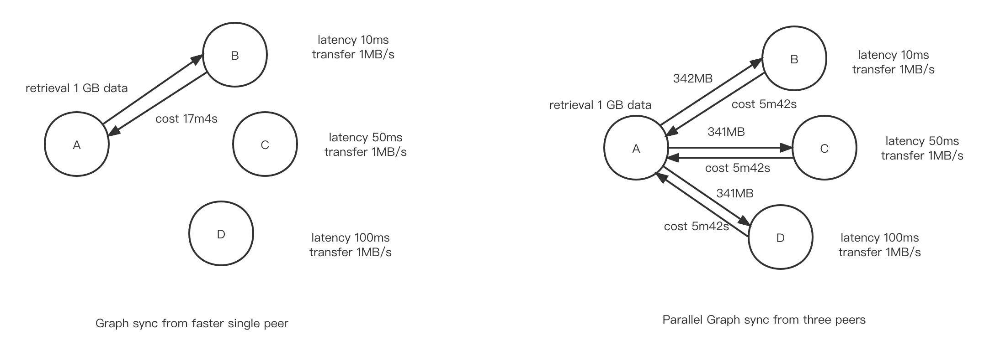

# go-parallel-graphsync

### Project Description

Currently, most projects in Filecoin Retrieval Market use GraphSync to synchronize data.

GraphSync works well when synchronizing small-volume files. Users can synchronize these multiple files from different nodes by downloading them in parallel. This way could spread the bandwidth pressure of one single node and shorten the synchronization time.

However, this one-to-one synchronizing method may not work well for large files. If data synchronization time becomes longer,  from minutes to tens of minutes or even hours, a single node's bandwidth load will increase. Besides, other nodes with the same data do not provide retrieval services, so resources in the Filecoin network can not be fully utilized.

ParallelGraphSync aims to provide a solution for synchronizing large files in Filecoin Retrieval Market. It can dynamically adjust the synchronization strategy of data blocks to achieve parallel download by connecting multiple nodes with retrieved data and measuring the synchronization speed of the nodes.

For example, we assume Node A needs to synchronize a 1GiB file and Node B, C, and D have duplicate file copies. Network delays between Node A and other nodes are:

- A to B: 10ms
- A to C: 50ms
- A to D: 100ms

The transmission speed from Node B, C, and D to A are all 1MB/s.



The results could be:

- By using GraphSync, it takes about 17mins to synchronize this file from Node B(optimal) to Node A.
- By using ParallelGraphSync, if we adjust the synchronization strategy according to their network delay and transmission speed, it takes about 5mins 42s to complete the same work.

The actual situation will be more complicated and time-consuming but will not affect parallel synchronization's advantages.

For one-to-one data synchronization, the increase in data copies only increases the throughput of a CDN network. The data retrieval speed can not improve significantly and is limited to a single node's transmission speed.
With ParallelGraphSync, the number of data copies can increase the entire network's throughput and significantly improve the retrieval speed, especially for large files.


### Value

- Shift traffic from a single node to multiple nodes
- Spread the bandwidth pressure of one single node
- Increase the speed of content delivery
- Improve the utilization of network resources


### Usage

### Initializing a Parallel GraphSync Exchange

```golang
import (
  pargraphsyncimpl "github.com/filedrive-team/go-parallel-graphsync/impl"
  gsnet "github.com/ipfs/go-graphsync/network"
  ipld "github.com/ipld/go-ipld-prime"
)

var ctx context.Context
var host libp2p.Host
var lsys ipld.LinkSystem

network := gsnet.NewFromLibp2pHost(host)
exchange := pargraphsyncimpl.New(ctx, network, lsys)
```

Parameter Notes:

1. `context` is just the parent context for all of GraphSync
2. `network` is a network abstraction provided to Graphsync on top
   of libp2p. This allows graphsync to be tested without the actual network
3. `lsys` is an go-ipld-prime LinkSystem, which provides mechanisms loading and constructing go-ipld-prime nodes from a link, and saving ipld prime nodes to serialized data

### Using Parallel GraphSync With An IPFS BlockStore

GraphSync provides a convenience function in the `storeutil` package for
integrating with BlockStore's from IPFS.

```golang
import (
  pargraphsyncimpl "github.com/filedrive-team/go-parallel-graphsync/impl"
  gsnet "github.com/ipfs/go-graphsync/network"
  storeutil "github.com/ipfs/go-graphsync/storeutil"
  ipld "github.com/ipld/go-ipld-prime"
  blockstore "github.com/ipfs/go-ipfs-blockstore"
)

var ctx context.Context
var host libp2p.Host
var bs blockstore.Blockstore

network := gsnet.NewFromLibp2pHost(host)
lsys := storeutil.LinkSystemForBlockstore(bs)

exchange := pargraphsyncimpl.New(ctx, network, lsys)
```

### Calling Parallel GraphSync

```golang
var exchange pargraphsync.ParallelGraphExchange
var ctx context.Context
var peers []peer.ID
var selector ipld.Node
var root ipld.Link
var extensions []graphsync.ExtensionData

var responseProgress <-chan graphsync.ResponseProgress
var errors <-chan error

responseProgress, errors = exchange.RequestMany(ctx context.Context, peers []peer.ID, root ipld.Link, selector ipld.Node, extensions ...graphsync.ExtensionData)
```

Paramater Notes:
1. `ctx` is the context for this request. To cancel an in progress request, cancel the context.
2. `peers` is the peers list you will send this request to
3. `root` is an IPLD Link, i.e. a CID (cidLink.Link{Cid})
4. `selector` is an IPLD selector node. Recommend using selector builders from go-ipld-prime to construct these
5. `extensions` is the extension list parameter for this request，generally be ignored

### Response Type

```golang

type ResponseProgress struct {
  Node      ipld.Node // a node which matched the graphsync query
  Path      ipld.Path // the path of that node relative to the traversal start
	LastBlock struct {  // LastBlock stores the Path and Link of the last block edge we had to load. 
		ipld.Path
		ipld.Link
	}
}

```

The above provides both immediate and relevant metadata for matching nodes in a traversal, and is very similar to the information provided by a local IPLD selector traversal in `go-ipld-prime`


### Benchmark

```shell
go test -v -test.run '^Bench.*$' -test.bench 'BenchmarkGraphSync' ./example/ -benchtime=20x --benchmem

goos: darwin
goarch: amd64
pkg: github.com/filedrive-team/go-parallel-graphsync/example
cpu: Intel(R) Core(TM) i7-9750H CPU @ 2.60GHz
BenchmarkGraphSync
BenchmarkGraphSync/Parallel-Graphsync_request_to_3_services
BenchmarkGraphSync/Parallel-Graphsync_request_to_3_services-12                20         339754734 ns/op        938274530 B/op    182571 allocs/op
BenchmarkGraphSync/Graphsync_request_to_1_service
BenchmarkGraphSync/Graphsync_request_to_1_service-12                          20         520008977 ns/op        932649795 B/op    164291 allocs/op
PASS
ok      github.com/filedrive-team/go-parallel-graphsync/example 19.522s
```
